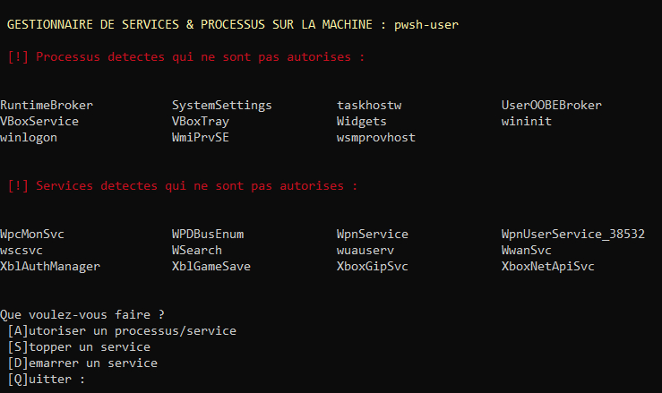

# Service & Processus Management Script 

## Overview
🛠️ Unlock efficient service and process management with our script for seamless and optimized system operations.

## Features
- Collects information about currently running services and processes on a remote machine.
- Allows the user to define authorized services and processes by saving them in the corresponding CSV files.
- Manages authorization of services and processes based on the authorization CSV files.

## Prerequisites
- PowerShell must be installed on the machine running the script.
- Necessary permissions to access the remote machine.

## Usage
1. Ensure you have the prerequisites installed (insert prerequisites if applicable).
2. Download the `servProc.ps1` script.
3. Execute the script using the command: `.\servProc.ps1`.

## CSV File Structure
authProc.csv: List of authorized processes.
actProc.csv: List of currently running processes.
authServ.csv: List of authorized services.
actServ.csv: List of currently running services.

## Contribution
Contributions are welcome! If you'd like to contribute.

## Contact
For any questions or comments, feel free to contact us at mateja.velickovic@eduvaud.ch.
